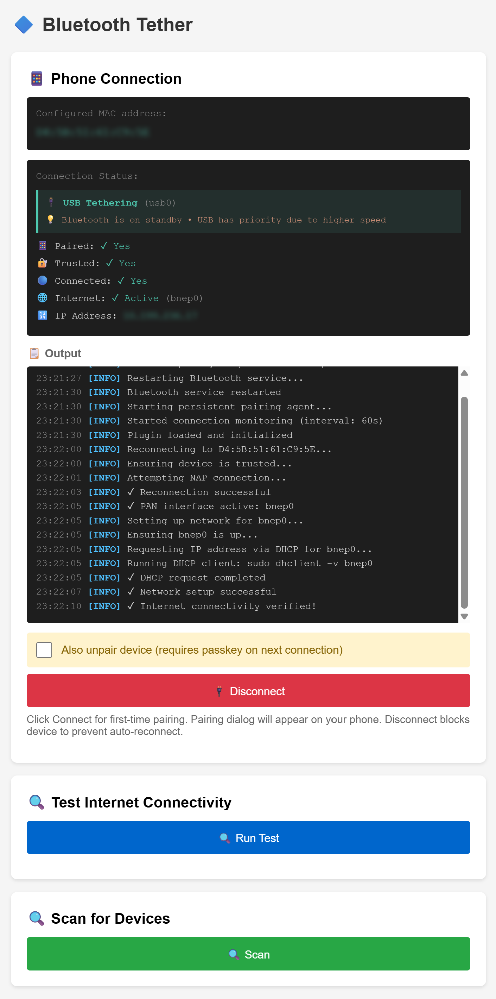

# bt-tether-helper

> **🚧 Work in Progress:** This plugin is currently under active development. Features and functionality may change.
>
> **ℹ️ Note:** This plugin is a full replacement for the default [bt-tether.py](https://github.com/jayofelony/pwnagotchi/blob/noai/pwnagotchi/plugins/default/bt-tether.py) shipped with Pwnagotchi. It is not a helper or add-on for that plugin, but a standalone alternative with expanded features and improved reliability.
>
> **⚠️ Warning:** Do not enable both this plugin and the default bt-tether.py at the same time. Only one Bluetooth tethering plugin should be active to avoid conflicts.
>
> **✅ Important:** This plugin has been tested on an **Android 15** and **iOS 26.1** with [Pwnagotchi v2.9.5.3](https://github.com/jayofelony/pwnagotchi/releases/tag/v2.9.5.3). **Bluetooth tethering must be enabled on your device** for this plugin to work. Compatibility with other versions has not been tested.

A comprehensive Bluetooth tethering plugin that provides guided setup and automatic connection management for sharing your phone's internet connection with your Pwnagotchi.



## Tested Hardware Configuration

**Development & Testing:**

- **Device:** Raspberry Pi Zero 2WH
- **Display:** Waveshare 2.13-inch e-ink display (with built-in RTC chip and battery)
- **Power Management:** Waveshare UPS HAT (C)

_Optimizations have been applied for RPi Zero W2's resource constraints (512MB RAM, 1GB storage, slower CPU)._

## Features

- **Web Interface**: User-friendly web UI for managing Bluetooth connections
- **Automatic Pairing**: Interactive pairing with passkey display and confirmation
- **Connection Management**: Connect and disconnect devices with one click
- **Auto-Reconnect**: Automatically detects and reconnects dropped connections
- **Device Scanning**: Scan for nearby Bluetooth devices to find and copy MAC addresses
- **Status Display**: Real-time connection status on Pwnagotchi screen
- **PAN (Personal Area Network) Support**: Automatic network interface configuration
- **Discord Notifications**: Optional webhook notifications when connected with IP address

## Installation

1. Copy `bt-tether-helper.py` to your Pwnagotchi's custom plugins directory:

   ```bash
   sudo cp bt-tether-helper.py /usr/local/share/pwnagotchi/custom-plugins/
   ```

2. Find your phone's MAC address:

   - Use the web interface scan function (see Usage section below), or
   - Check in Android: Settings → About Phone → Status → Bluetooth address

3. Add your phone's MAC address to `/etc/pwnagotchi/config.toml`:

   ```toml
   main.plugins.bt-tether-helper.enabled = true
   main.plugins.bt-tether-helper.mac = "XX:XX:XX:XX:XX:XX"
   ```

   > See [Configuration Options](#configuration-options) for additional settings (display, auto-reconnect, etc.)

4. Restart Pwnagotchi:
   ```bash
   pwnkill
   ```

> **Note:** All required dependencies (`dbus-python`, `toml`, `bluez`) are already included in Pwnagotchi - no additional packages needed!

## Usage

### Web Interface

Access the web interface at: `http://<pwnagotchi-ip>:8080/plugins/bt-tether-helper`

**Features:**

- **Connect to Phone**: Initiate connection to your configured device
- **Disconnect**: Safely disconnect from paired device (automatically unpairs)
- **Scan**: Discover nearby Bluetooth devices
- **Status**: Real-time connection and internet status
- **Internet Test**: Test connectivity with detailed diagnostics (ping, DNS, IP, routing)
- **Active Route Display**: Shows which network interface is handling internet traffic

### Network Priority

When multiple network interfaces are active (e.g., USB and Bluetooth), the web interface displays:

- **Active Route Indicator**: Shows which interface (usb0, bnep0, etc.) is currently handling internet traffic
- **USB Priority Warning**: Alerts when USB connection has priority over Bluetooth (USB typically has lower route metric)

> **Note:** When multiple network interfaces are available (such as USB, Ethernet, or Bluetooth), internet traffic is always routed through the best available connection by default. Typically, the system prioritizes interfaces in this order: Ethernet (`eth0`), USB (`usb0`), then Bluetooth (`bnep0`). Bluetooth tethering remains active as a standby connection and will automatically take over if higher-priority connections (like USB or Ethernet) are disconnected. You can view the currently active interface and routing details in the web interface's status section. This ensures your Pwnagotchi always uses the most reliable and fastest available connection for internet access.

### Testing Internet Connectivity

Use the **"Test Internet Connectivity"** button in the web interface to verify your connection:

- **Ping Test**: Verifies IP connectivity to 8.8.8.8
- **DNS Test**: Tests DNS resolution using Python's socket library (resolves google.com)
- **DNS Servers**: Shows configured DNS servers from /etc/resolv.conf
- **Interface IP**: Shows the IP address assigned to bnep0
- **Default Route**: Displays the active routing configuration
- **Localhost Route**: Verifies localhost (127.0.0.1) routes correctly through loopback interface

This is especially useful for troubleshooting when you have multiple network interfaces active.

### Connection Process

1. **Enable Bluetooth Tethering on Your Android Phone:**

   Go to: Settings → Network & internet → Hotspot & tethering → Bluetooth tethering (Enable it)

   > **Note:** Bluetooth tethering **must be enabled** before attempting to connect.

2. **Pairing (First Time Only):**

   - Make sure your phone's MAC address is configured in `/etc/pwnagotchi/config.toml` (see Installation)
   - Click "Connect to Phone" in the web interface
   - A pairing dialog will appear on your phone
   - Verify the passkey matches on both devices
   - Tap "Pair" on your phone
   - Wait for connection to complete (up to 90 seconds)

3. **Subsequent Connections:**
   - Once paired, simply click "Connect to Phone" in the web interface
   - Device will automatically connect and establish internet connection

### On-Screen Status Indicators

The plugin provides two display modes that can be used independently or together:

**1. Compact Status (top-right corner):**

- Single-letter indicator (configurable via `position`)
- Minimal screen space usage
- Quick status at a glance

**2. Detailed Status (default: position [0, 82]):**

- Full status text with IP address when connected
- Shows pairing/trust state
- Configurable via `detailed_status_position`

Both displays update in real-time based on connection state.

## Configuration Options

```toml
# Core Settings
main.plugins.bt-tether-helper.enabled = true  # Enable the plugin
main.plugins.bt-tether-helper.mac = "XX:XX:XX:XX:XX:XX"  # Required: your phone's Bluetooth MAC address

# Display Settings
main.plugins.bt-tether-helper.show_on_screen = true  # Master switch: enable/disable all on-screen display (default: true)
main.plugins.bt-tether-helper.show_mini_status = true  # Show compact mini status indicator (single letter) (default: true)
main.plugins.bt-tether-helper.mini_status_position = null  # Position [x, y] for mini status (null = auto top-right)
main.plugins.bt-tether-helper.show_detailed_status = true  # Show detailed status line with IP (default: true)
main.plugins.bt-tether-helper.detailed_status_position = [0, 82]  # Position for detailed status (default: [0, 82])

# Auto-Reconnect Settings
main.plugins.bt-tether-helper.auto_reconnect = true  # Automatically reconnect when connection drops (default: true)
main.plugins.bt-tether-helper.reconnect_interval = 60  # Check connection every N seconds (default: 60)
main.plugins.bt-tether-helper.reconnect_failure_cooldown = 300  # Cooldown after max failures in seconds (default: 300 = 5 minutes)

# Discord Notifications (Optional)
main.plugins.bt-tether-helper.discord_webhook_url = "https://discord.com/api/webhooks/YOUR_WEBHOOK_URL"  # Send IP notifications to Discord (optional)
```

### Display Options

**Master Switch (`show_on_screen`):**

- When `false`, disables ALL on-screen display (both mini and detailed status)
- When `true`, allows mini and detailed status to be shown based on their individual settings

**Mini Status (`show_mini_status`):**

- Shows single-letter status indicator (typically top-right corner)
- **I** = Initializing (plugin startup)
- **C** = Connected with internet (PAN active)
- **T** = Connected and trusted (no internet yet)
- **N** = Connected but not trusted
- **P** = Paired but not connected
- **>** = Connecting/Pairing/Reconnecting in progress
- **X** = Disconnecting or Disconnected
- **U** = Untrusting (removing trust)
- **?** = Unknown/Error

Position can be customized with `mini_status_position = [x, y]` or set to `null` for automatic top-right placement.

**Detailed Status (`show_detailed_status`):**

- Shows full status at configurable position (default: [0, 82])
- **BT:Initializing...** = Plugin initializing
- **BT:10.199.236.17** = Connected with IP address
- **BT:Trusted** = Connected and trusted but no IP yet
- **BT:Connected** = Connected but not trusted
- **BT:Paired** = Paired but not connected
- **BT:Connecting...** = Connection in progress
- **BT:Reconnecting...** = Auto-reconnection in progress
- **BT:Disconnecting...** = Disconnection in progress
- **BT:Untrusting...** = Removing trust from device
- **BT:Disconnected** = Not connected
- **BT:Error** = Error/unknown state

Customize position with `detailed_status_position = [x, y]`.

### Auto-Reconnect

The plugin includes intelligent automatic reconnection monitoring with failure backoff:

- **Enabled by default**: Monitors your Bluetooth connection and automatically reconnects if it drops
- **Configurable interval**: Checks connection status every 60 seconds by default (via `reconnect_interval`)
- **Smart reconnection**: Only attempts reconnection when device is paired/trusted but disconnected
- **Failure handling**: After 5 consecutive failed reconnection attempts, enters a 5-minute cooldown period
- **Non-intrusive**: Won't interfere with manual connection/disconnection operations
- **Respects user actions**: Doesn't auto-reconnect if you manually disconnected the device

To disable auto-reconnect, set `main.plugins.bt-tether-helper.auto_reconnect = false` in your config.

## Connection & Reconnection Flows

### Initial Connection Flow (First Time Pairing)

1. **User initiates connection** via web interface or plugin startup
2. **Pwnagotchi becomes discoverable** - Bluetooth adapter set to pairable/discoverable mode
3. **Remove old pairing** (if exists) - Ensures clean pairing state
4. **Unblock device** - Removes any previous blocks
5. **Pairing request sent** - Pwnagotchi requests pairing with phone
6. **Passkey dialog appears** on phone - User must accept within 90 seconds
7. **Trust device** - After successful pairing, device is marked as trusted for auto-connect
8. **Connect NAP service** - Establishes Bluetooth network connection (PAN profile)
9. **Wait for network interface** - bnep0 interface creation (up to 5 seconds)
10. **Configure network** - DHCP request to obtain IP address from phone
11. **Verify internet** - Tests connectivity to ensure tethering is working
12. **Status: CONNECTED** - Display shows "C" with IP address

**Typical duration:** 20-45 seconds for first-time pairing

### Subsequent Connection Flow (Already Paired)

1. **User initiates connection** or auto-reconnect triggered
2. **Verify device status** - Check if paired and trusted
3. **Unblock device** (if needed)
4. **Ensure trust** - Re-trust device to enable auto-connect
5. **Connect NAP service** - Establish tethering connection
6. **Wait for interface** - bnep0 appears
7. **Configure network** - DHCP configuration
8. **Verify internet** - Connectivity test
9. **Status: CONNECTED** - Ready to use

**Typical duration:** 10-20 seconds (no pairing dialog needed)

### Automatic Reconnection Flow

When connection drops (phone BT disabled, out of range, etc.):

1. **Monitor detects disconnection** - Checks every 60 seconds via `bluetoothctl info` and network interface status
2. **Triggers reconnection** - Sets status to "RECONNECTING"
3. **Attempt reconnect** - Follows subsequent connection flow
4. **Success handling:**
   - Resets failure counter
   - Updates status to CONNECTED
   - Continues monitoring
5. **Failure handling:**
   - Increments failure counter (max 5 attempts)
   - After 5 failures: Enters cooldown mode for 5 minutes
   - After cooldown: Resets counter and tries again
   - Logs warnings to help diagnose issues

**Reconnection intervals:**

- **Normal**: Every 60 seconds (configurable via `reconnect_interval`)
- **After 5 failures**: 5-minute cooldown (configurable via `reconnect_failure_cooldown`)

### Disconnection Detection Methods

The plugin uses multiple layers to detect when a device disconnects:

1. **Fast Path - Network Interface Check:**

   ```bash
   ip link show  # Check for bnep interface
   ip addr show bnep0  # Check for IP address
   ```

   If bnep interface disappears or loses IP → Connection lost

2. **Slow Path - Bluetooth Status Check:**

   ```bash
   bluetoothctl info XX:XX:XX:XX:XX:XX
   ```

   Parses output for:

   - `Connected: yes/no` - Bluetooth connection status
   - `Paired: yes/no` - Pairing status
   - `Trusted: yes/no` - Trust/auto-connect status

3. **State Comparison:**
   - Compares current `connected` status with previous check
   - If was connected (`True`) and now isn't (`False`) → Disconnection detected
   - Triggers auto-reconnect flow (unless user manually disconnected)

**What triggers reconnection:**

- Phone Bluetooth disabled → `Connected: no`
- Phone out of range → `Connected: no`
- Tethering disabled on phone → bnep interface disappears
- Connection lost for any reason → Status change detection

### Manual Disconnection

When you click "Disconnect" in the web interface:

1. **Disconnect initiated** - Sets `_user_requested_disconnect = True`
2. **NAP disconnect** - Closes Bluetooth network connection
3. **Block device** - Prevents automatic reconnection
4. **Optional: Unpair** - If "Also unpair device" is checked, removes pairing (requires passkey on next connection)
5. **Status: DISCONNECTED** - Monitor won't attempt auto-reconnect
6. **Interface cleanup** - bnep interface removed

To reconnect after manual disconnect, use the web interface "Connect" button.

### Discord Notifications

Get notified when your Pwnagotchi connects via Bluetooth tethering:

- **Optional Feature**: Only activates when `discord_webhook_url` is configured
- **IP Address Notifications**: Automatically sends your device's IP address to a private Discord channel
- **Works with Auto-Reconnect**: Notifications sent both on manual connections and automatic reconnections
- **Easy Setup**: Just create a Discord webhook and add the URL to your config
- **Non-Blocking**: Runs in background thread, won't delay connection even if webhook fails

**How to set up Discord webhook:**

1. In your Discord server, go to Server Settings → Integrations → Webhooks
2. Click "New Webhook"
3. Give it a name (e.g., "Pwnagotchi BT")
4. Select the channel where you want notifications
5. Copy the webhook URL
6. Add it to your config: `main.plugins.bt-tether-helper.discord_webhook_url = "YOUR_WEBHOOK_URL"`
7. Restart Pwnagotchi: `pwnkill`

When your device connects, you'll receive a notification with the IP address and device name!

**Troubleshooting Discord Notifications:**

- Check logs with `pwnlog` to see if the webhook is being called
- Verify the webhook URL is correct in your config
- Make sure your Pwnagotchi has internet access via the Bluetooth connection
- Test the webhook URL directly with a tool like curl to verify it's working

## Troubleshooting

### Pairing Fails

- Ensure Bluetooth is enabled on your phone
- Make sure your phone is in Bluetooth settings (visible/discoverable)
- Check that pairing dialog appears on phone within 90 seconds
- Try unpairing the device first, then pair again

### Connection Succeeds but No Internet

- Enable Bluetooth tethering in your phone's settings
- Check that your phone has an active internet connection (mobile data or WiFi)
- Use the **"Test Internet Connectivity"** button in the web interface to diagnose the issue
- Check if USB is connected - if so, USB may be taking priority (see Active Route display)
- Try disconnecting and reconnecting

### Bluetooth Service Unresponsive

- The plugin automatically detects and restarts hung Bluetooth services
- Manual restart: `sudo systemctl restart bluetooth`
- Check logs: `pwnlog`

### Device Won't Disconnect

- Use the "Disconnect" button in web interface (automatically blocks device)
- Manual command: `bluetoothctl disconnect XX:XX:XX:XX:XX:XX`
- If still connected, unpair the device

## Advanced

### Finding Your Phone's MAC Address

**Android:**

```
Settings → About Phone → Status → Bluetooth address
```

**iOS:**

```
Settings → General → About → Bluetooth
```

**Via Terminal:**

```bash
bluetoothctl devices
```

## API Endpoints

The plugin provides REST API endpoints for external control:

- `GET /plugins/bt-tether-helper` - Web interface
- `POST /plugins/bt-tether-helper/connect?mac=XX:XX:XX:XX:XX:XX` - Initiate connection
- `POST /plugins/bt-tether-helper/disconnect?mac=XX:XX:XX:XX:XX:XX` - Disconnect device
- `POST /plugins/bt-tether-helper/unpair?mac=XX:XX:XX:XX:XX:XX` - Unpair device
- `GET /plugins/bt-tether-helper/status` - Get current status
- `GET /plugins/bt-tether-helper/pair-status?mac=XX:XX:XX:XX:XX:XX` - Check pairing status
- `GET /plugins/bt-tether-helper/connection-status?mac=XX:XX:XX:XX:XX:XX` - Full connection details
- `GET /plugins/bt-tether-helper/scan` - Scan for devices (30 seconds)
- `GET /plugins/bt-tether-helper/test-internet` - Test internet connectivity with detailed diagnostics

## License

GPL3

## Author

**wsvdmeer**

## Support

For issues or questions:

1. Check the troubleshooting section above
2. Review Pwnagotchi logs: `pwnlog`
3. Open an issue with detailed error messages and configuration
