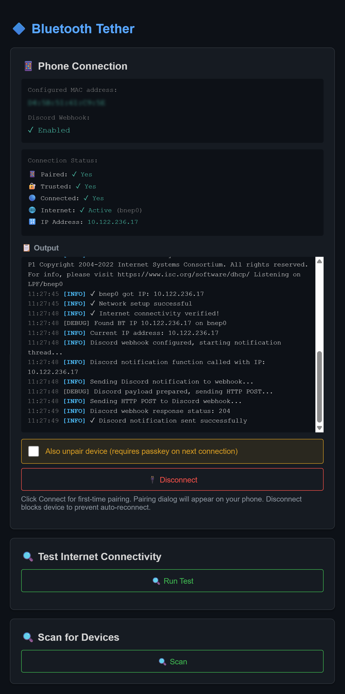

# bt-tether (v1.2.5)

> **ℹ️ Note:** This plugin is a full replacement for the default [bt-tether.py](https://github.com/jayofelony/pwnagotchi/blob/noai/pwnagotchi/plugins/default/bt-tether.py) shipped with Pwnagotchi. It is not a helper or add-on for that plugin, but a standalone alternative with expanded features and improved reliability.
>
> **⚠️ Warning:** Do not enable both this plugin and the default bt-tether.py at the same time. Only one Bluetooth tethering plugin should be active to avoid conflicts.

> **✅ Important:** This plugin has been tested on **Android 15 & 16** with [Pwnagotchi v2.9.5.3](https://github.com/jayofelony/pwnagotchi/releases/tag/v2.9.5.3) and [v2.9.5.4](https://github.com/jayofelony/pwnagotchi/releases/tag/v2.9.5.4). **Bluetooth tethering must be enabled on your device** for this plugin to work. Compatibility with other versions has not been tested.
>
> **🆕 No manual MAC configuration required!** The web UI can scan, pair, and manage devices automatically. MAC randomization is handled for both iOS and Android. Manual MAC entry is not needed.

A comprehensive Bluetooth tethering plugin that provides guided setup and automatic connection management for sharing your phone's internet connection with your Pwnagotchi.



## Tested Hardware Configuration

**Development & Testing:**

- **Device:** Raspberry Pi Zero 2WH
- **Display:** Waveshare 2.13-inch e-ink display (with built-in RTC chip and battery)
- **Power Management:** Waveshare UPS HAT (C)

_Optimizations have been applied for RPi Zero W2's resource constraints (512MB RAM, 1GB storage, slower CPU)._

## Features

- **Web Interface**: User-friendly web UI for scanning, pairing, and managing Bluetooth connections
- **Automatic Pairing & Discovery**: Scan and pair with your phone directly from the web UI—no need to manually enter MAC addresses (works with iOS randomized MACs)
- **Auto-Connect on Startup**: Automatically finds and connects to trusted devices when Pwnagotchi boots
- **Auto-Reconnect**: Monitors the connection and automatically reconnects when it drops
- **Status Display**: Real-time connection status on Pwnagotchi's e-ink screen (mini + detailed)
- **PAN (Personal Area Network) Support**: Automatic network interface and DHCP configuration
- **Plugin Event System**: Emits `bt_tether_connected` and `bt_tether_disconnected` events that other plugins can listen to for custom integrations (see [Related Plugins](#related-plugins))

## Installation

1. **Copy `bt-tether.py` to your Pwnagotchi's custom plugins directory:**

   ```bash
   sudo cp bt-tether.py /usr/local/share/pwnagotchi/custom-plugins/
   ```

2. **Restart Pwnagotchi:**
   ```bash
   pwnkill
   ```

All required dependencies (bluez, NetworkManager, python3-dbus, python3-toml) are already included with Pwnagotchi.

## Connection Process

1. **Enable Bluetooth Tethering on Your Phone:**

   Go to: Settings → Network & internet → Hotspot & tethering → Bluetooth tethering (Enable it)

   > **Note:** Bluetooth tethering **must be enabled** before attempting to connect.

2. **Pair Your Phone (First Time Only):**
   - Open the web interface at `http://<pwnagotchi-ip>:8080/plugins/bt-tether`
   - Click **Scan** to discover nearby Bluetooth devices
   - Click **Pair** next to your phone in the discovered devices list
   - A pairing dialog will appear on your phone — verify the passkey matches and tap "Pair"
   - The plugin will automatically connect and establish internet after pairing (up to 90 seconds)

3. **After Pairing:**
   - The plugin **auto-connects** to your paired device on every Pwnagotchi boot
   - If the connection drops (phone out of range, Bluetooth off, etc.), it **auto-reconnects** when the phone is available again
   - No manual intervention needed for subsequent connections

## Configuration Options

```toml
[main.plugins.bt-tether]
enabled = true  # Enable the plugin

# Display Settings
show_on_screen = true  # Master switch: enable/disable all on-screen display (default: true)
show_mini_status = true  # Show compact mini status indicator (single letter) (default: true)
mini_status_position = [110, 0]  # Position [x, y] for mini status (default: [110, 0])
show_detailed_status = true  # Show detailed status line with IP (default: true)
detailed_status_position = [0, 82]  # Position for detailed status (default: [0, 82])

# Auto-Reconnect Settings
auto_reconnect = true  # Automatically reconnect when connection drops (default: true)
reconnect_interval = 60  # Check connection every N seconds (default: 60)
reconnect_failure_cooldown = 300  # Cooldown after max failures in seconds (default: 300 = 5 minutes)
```

## Usage

### Web Interface

Access the web interface at: `http://<pwnagotchi-ip>:8080/plugins/bt-tether`

The interface consists of the following sections:

**Connection Status** — Main panel showing:
- **Trusted Devices**: Lists paired devices with tethering capability
- **Status Indicators**: Real-time Paired / Trusted / Connected / Internet status with checkmarks
- **Active Connection**: Shows which network interface is handling internet traffic (Bluetooth, USB, Ethernet, Wi-Fi) with standby notifications when a higher-priority interface is active
- **IP Address**: Displayed when connected with an active PAN interface
- **Output Log**: Live scrolling log of plugin activity (pairing, connecting, errors)

**Connect / Disconnect** — Action buttons:
- **Connect to Phone**: Initiates connection to a trusted device (hidden when already connected)
- **Disconnect**: Disconnects, blocks, and unpairs the device. Requires re-pairing to connect again

**Discover Devices** — Only shown when no trusted devices exist:
- **Scan**: Discovers nearby Bluetooth devices (30 second scan with live results)
- **Pair**: One-click pairing from the discovered devices list

**Test Internet Connectivity** — Only shown when connected:
- Runs ping, DNS, IP, default route, and localhost route diagnostics

### Network Priority

When multiple network interfaces are active, the web interface shows which interface is handling internet traffic. The system prioritizes interfaces in this order: Ethernet (`eth0`) → USB (`usb0`) → Bluetooth PAN (`bnep0`). Bluetooth tethering remains on standby and automatically takes over when higher-priority connections disconnect.

### On-Screen Status Indicators

The plugin provides two display modes that can be used independently or together:

**Mini Status (`show_mini_status`):**

Single-letter indicator showing current state:

| Letter | State | Description |
|--------|-------|-------------|
| **I** | Initializing | Plugin startup, Bluetooth service restarting |
| **S** | Scanning | Device discovery in progress |
| **P** | Pairing | Pairing with phone in progress |
| **T** | Trusting / Untrusting | Trusting device or removing trust |
| **>** | Connecting | Connection in progress |
| **R** | Reconnecting | Auto-reconnection attempt |
| **C** | Connected | Connected with internet (PAN active) |
| **N** | No internet | Connected but PAN not active |
| **D** | Disconnecting | Disconnect in progress |
| **X** | Disconnected | No device or not connected |
| **?** | Error | Unknown state or error |

Position can be customized with `mini_status_position = [x, y]` (default: `[110, 0]`).

**Detailed Status (`show_detailed_status`):**

Full status line at a configurable position:

| Display | Meaning |
|---------|---------|
| **BT:Initializing** | Plugin initializing |
| **BT:Scanning** | Scanning for devices |
| **BT:Pairing** | Pairing in progress |
| **BT:Trusting** | Trusting device |
| **BT:Connecting...** | Connection in progress |
| **BT:Reconnecting...** | Auto-reconnection attempt |
| **BT:192.168.44.2** | Connected with IP address |
| **BT:Connected** | Connected (PAN active, no IP yet) |
| **BT:Trusted** | Connected and trusted (no PAN) |
| **BT:Paired** | Paired but not connected |
| **BT:Disconnecting...** | Disconnect in progress |
| **BT:Untrusting...** | Removing trust from device |
| **BT:Disconnected** | Not connected |
| **BT:No device** | No paired device found |
| **BT:Error** | Error or unknown state |

Position can be customized with `detailed_status_position = [x, y]` (default: `[0, 82]`).

### Auto-Reconnect

The plugin includes automatic reconnection monitoring with failure backoff:

- **Enabled by default**: Monitors your Bluetooth connection and automatically reconnects if it drops
- **Configurable interval**: Checks connection status every 60 seconds (via `reconnect_interval`)
- **Smart reconnection**: Only attempts reconnection when device is paired/trusted but disconnected
- **Failure handling**: After 5 consecutive failures, enters a cooldown period (default: 5 minutes via `reconnect_failure_cooldown`)
- **Respects user actions**: Doesn't auto-reconnect if you manually disconnected the device
- **Error classification**: Transient errors (phone out of range) preserve pairing; permanent errors (authentication rejected) remove pairing

To disable auto-reconnect, set `auto_reconnect = false` in your config.

## Connection & Reconnection Flows

### Initial Connection Flow (First Time Pairing)

1. **User initiates pairing** via web interface scan + pair
2. **Pwnagotchi becomes discoverable** — Bluetooth adapter set to pairable/discoverable mode
3. **Remove old pairing** (if exists) — Ensures clean pairing state
4. **Pairing request sent** — Pwnagotchi requests pairing with phone
5. **Passkey dialog appears** on phone — User must accept within 90 seconds
6. **Trust device** — Device is marked as trusted for auto-connect
7. **Connect NAP service** — Establishes Bluetooth network connection (PAN profile)
8. **Configure network** — DHCP request to obtain IP address from phone
9. **Verify internet** — Tests connectivity to ensure tethering is working
10. **Status: CONNECTED** — Display shows "C" with IP address

**Typical duration:** 20-45 seconds

### Auto-Connect on Startup

When Pwnagotchi boots with `auto_reconnect = true`:

1. Plugin initializes Bluetooth services and starts the pairing agent
2. Scans for trusted devices with NAP (tethering) capability
3. Automatically connects to the best available trusted device
4. Configures network via DHCP and verifies internet connectivity

### Automatic Reconnection

When a connection drops (phone BT disabled, out of range, etc.):

1. **Monitor detects disconnection** via network interface and Bluetooth status checks
2. **Emits `bt_tether_disconnected` event** with reason `connection_dropped`
3. **Attempts reconnection** using NAP connection via D-Bus
4. **On success**: Resets failure counter, emits `bt_tether_connected` event
5. **On failure**: Increments failure counter (max 5 attempts), then enters cooldown

**Error classification:**
- **Transient errors** (page-timeout, host-down): Pairing is preserved, retry later
- **Permanent errors** (authentication rejected, connection refused): Pairing removed, re-pairing needed

### Manual Disconnection

When you click "Disconnect" in the web interface, the plugin:

1. Disconnects the NAP profile and Bluetooth connection
2. Blocks the device to prevent auto-reconnection
3. Removes (unpairs) the device completely
4. Emits `bt_tether_disconnected` event with reason `user_request`

To connect again after a manual disconnect, scan and pair the device again through the web interface.

## Creating Custom Plugins

The bt-tether plugin emits events that other plugins can listen to, allowing you to build custom integrations (notifications, logging, remote updates, etc.).

### Available Events

**`bt_tether_connected`** — Fired when connection is established and internet connectivity is verified.

```python
{
    "mac": "AA:BB:CC:DD:EE:FF",           # Device MAC address
    "device": "My iPhone",                 # Device name
    "ip": "192.168.1.42",                 # IP address assigned to Pwnagotchi
    "interface": "bnep0",                  # PAN interface name
    "pwnagotchi_name": "pwnagotchi"       # Pwnagotchi device name (auto-populated)
}
```

**`bt_tether_disconnected`** — Fired when connection drops or user disconnects.

```python
{
    "mac": "AA:BB:CC:DD:EE:FF",           # Device MAC address
    "device": "My iPhone",                 # Device name
    "reason": "user_request",              # Reason: user_request, connection_dropped, or error
    "pwnagotchi_name": "pwnagotchi"       # Pwnagotchi device name (auto-populated)
}
```

### Example: Custom Listener Plugin

Create a plugin file (e.g., `custom-plugins/my-bt-logger.py`):

```python
import logging
from pwnagotchi.plugins import Plugin


class MyBTLogger(Plugin):
    """Custom plugin that logs Bluetooth tether connections."""

    def on_bt_tether_connected(self, agent, event_data):
        """Handle bluetooth tether connection event."""
        ip = event_data.get("ip", "unknown")
        device = event_data.get("device", "unknown")
        logging.info(f"[my-bt-logger] BT Connected: {device} ({ip})")

    def on_bt_tether_disconnected(self, agent, event_data):
        """Handle bluetooth tether disconnection event."""
        device = event_data.get("device", "unknown")
        reason = event_data.get("reason", "unknown")
        logging.info(f"[my-bt-logger] BT Disconnected: {device} (reason: {reason})")
```

Enable it in `config.toml`:

```toml
[main.plugins.my-bt-logger]
enabled = true
```

### Plugin Development Tips

- **Event method naming**: Pwnagotchi dispatches events to methods named `on_<event_name>`
- **Non-blocking**: Keep event handlers fast; offload heavy work to background threads
- **Error handling**: Wrap your logic in try/except to prevent one plugin from affecting others
- **Logging**: Use Python's `logging` module for consistent output (visible via `pwnlog`)

## Related Plugins

These companion plugins extend `bt-tether` by listening to its connection events:

| Plugin                                       | Events Used                                           | Description                                                                  |
| -------------------------------------------- | ----------------------------------------------------- | ---------------------------------------------------------------------------- |
| [bt-tether-discord](../bt-tether-discord/)   | `bt_tether_connected`, `bt_tether_disconnected`   | Sends Discord embed notifications when BT tethering connects or disconnects  |
| [bt-tether-telegram](../bt-tether-telegram/) | `bt_tether_connected`                               | Sends Telegram messages when BT tethering connects                           |
| [bt-tether-helper](../bt-tether-helper/)     | —                                                     | Helper utilities for BT tether integrations                                  |

Use these plugins as reference implementations when building your own custom integrations.

## Troubleshooting

### Pairing Fails

- Ensure Bluetooth is enabled on your phone
- Make sure your phone is in Bluetooth settings (visible/discoverable)
- Check that pairing dialog appears on phone within 90 seconds
- Try disconnecting the device first, then scan and pair again

### Connection Succeeds but No Internet

- Enable Bluetooth tethering in your phone's settings
- Check that your phone has an active internet connection (mobile data or WiFi)
- Use the **"Test Internet Connectivity"** button in the web interface to diagnose the issue
- Check if USB is connected — USB takes priority over Bluetooth (see Active Connection in web UI)
- Try disconnecting and reconnecting

### Bluetooth Service Unresponsive

- The plugin automatically restarts hung Bluetooth services on startup
- Manual restart: `sudo systemctl restart bluetooth`
- Check logs: `pwnlog`

### Ghost Connections from Previous bt-tether Plugin

If you previously used the default `bt-tether.py` plugin, you may have ghost connection profiles left behind by NetworkManager that cause conflicts.

**Symptoms:**
- Connection fails intermittently with D-Bus/BlueZ errors
- Multiple connection attempts required
- "Device already connected" errors despite no active connection

**Fix:**

```bash
# List all NetworkManager connections
sudo nmcli connection show

# Remove ghost profiles by UUID
sudo nmcli connection delete <uuid>

# Or remove stored connection files directly
sudo rm /etc/NetworkManager/system-connections/'phonename.nmconnection'

# Restart
pwnkill
```

### Device Won't Disconnect

- Use the "Disconnect" button in web interface (disconnects, blocks, and unpairs the device)
- Manual command: `bluetoothctl disconnect XX:XX:XX:XX:XX:XX`

## API Endpoints

The plugin provides REST API endpoints for external control:

| Method | Endpoint | Description |
|--------|----------|-------------|
| `GET` | `/plugins/bt-tether` | Web interface |
| `GET` | `/plugins/bt-tether/connect?mac=XX:XX:XX:XX:XX:XX` | Initiate connection (auto-selects device if MAC omitted) |
| `GET` | `/plugins/bt-tether/disconnect?mac=XX:XX:XX:XX:XX:XX` | Disconnect, block, and remove device |
| `GET` | `/plugins/bt-tether/pair-device?mac=XX:XX:XX:XX:XX:XX&name=Name` | Pair and connect to a new device |
| `GET` | `/plugins/bt-tether/status` | Plugin status (state, flags, current MAC) |
| `GET` | `/plugins/bt-tether/connection-status?mac=XX:XX:XX:XX:XX:XX` | Full connection details (paired, trusted, connected, PAN, IP) |
| `GET` | `/plugins/bt-tether/pair-status?mac=XX:XX:XX:XX:XX:XX` | Check pairing status |
| `GET` | `/plugins/bt-tether/trusted-devices` | List trusted devices with NAP capability |
| `GET` | `/plugins/bt-tether/scan` | Start device discovery (30 seconds) |
| `GET` | `/plugins/bt-tether/scan-progress` | Poll scan progress and discovered devices |
| `GET` | `/plugins/bt-tether/test-internet` | Run connectivity diagnostics |
| `GET` | `/plugins/bt-tether/logs` | Get plugin log buffer |

## License

GPL3

## Author

**wsvdmeer**

## Support

For issues or questions:

1. Check the troubleshooting section above
2. Review Pwnagotchi logs: `pwnlog`
3. Open an issue with detailed error messages and configuration
